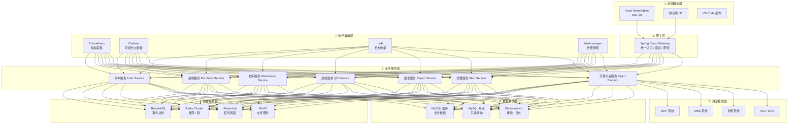
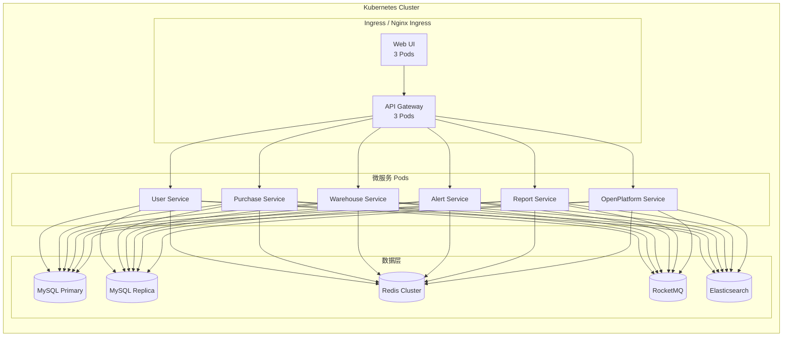

# 企业物资管理系统设计文档

> 项目代号：Enterprise Inventory Management System（EIMS）
> 版本：v1.0.0
> 日期：2026-04-18
> 状态：规划中

---

## 1. 项目概述

### 1.1 项目背景

企业物资管理是工业制造、化工、港口物流等行业的核心运营环节。传统物资管理系统普遍存在以下痛点：

- **数据孤岛**：采购、仓库、财务系统相互隔离，信息不同步
- **重复采购**：需求部门之间缺乏横向感知，导致相同物资重复下单
- **库存失控**：安全库存、预警阈值缺乏智能联动，经常性缺料或积压
- **报表滞后**：依赖人工 Excel 统计，数据时效性差
- **集成困难**：与 ERP、MES、PLC 系统对接成本高，维护困难

本项目旨在构建一套**企业级物资管理系统（EIMS）**，基于 RuoYi-Vue-Pro + Vue Vben Admin 技术栈，覆盖从需求提出、采购执行、仓库管理到数据分析的全链路流程。

### 1.2 项目目标

| 目标维度 | 具体指标 |
|---------|---------|
| 重复需求检测 | 采购需求重复率降低 60% |
| 库存准确率 | 库存账实一致率达到 99% 以上 |
| 预警及时率 | 预警触发到通知送达 < 5 分钟 |
| 数据导入效率 | 单批次 10000 条数据导入时间 < 30 秒 |
| 系统可用性 | 7×24 小时运行，SLA ≥ 99.9% |

### 1.3 用户角色（9 类）

| 序号 | 角色 | 职责描述 |
|-----|------|---------|
| 1 | **系统管理员** | 租户配置、用户管理、权限分配、系统参数设置 |
| 2 | **采购主管** | 审批采购计划、分配采购任务、供应商管理、价格谈判 |
| 3 | **采购员** | 执行采购订单、跟踪交货进度、处理到货验收 |
| 4 | **仓库管理员** | 入库/出库操作、库存盘点、报损管理、发货管理 |
| 5 | **质量检验员** | 到货质检、巡检、质检报告录入、不合格品处理 |
| 6 | **财务会计** | 发票核对、付款审批、成本核算、对账报表 |
| 7 | **需求部门用户** | 提交物资需求、跟踪申请进度、签收物资 |
| 8 | **数据分析师** | 自定义报表、趋势分析、数据导出 |
| 9 | **外部集成调用方** | 通过 OpenAPI 接入第三方系统 |

---

## 2. 技术选型

### 2.1 后端框架：RuoYi-Vue-Pro

| 层级 | 技术选型 | 版本 | 说明 |
|-----|---------|------|------|
| 基础框架 | Spring Boot | 3.2.x | 核心容器 |
| 持久层 | MyBatis-Plus | 3.5.x | ORM 增强，支持分页、主动连 |
| 安全框架 | Spring Security | 6.x | 认证授权 |
| 微服务 | Spring Cloud Alibaba | 2023.x | 服务注册、配置中心、网关 |
| 数据库 | MySQL | 8.0 | 主数据存储 |
| 缓存 | Redis | 7.x | 热点数据缓存、分布式锁 |
| 消息队列 | RocketMQ | 5.x | 异步消息、事件驱动 |
| 任务调度 | PowerJob / XXL-Job | 4.x | 定时任务、分布式调度 |
| 搜索引擎 | Elasticsearch | 8.x | 日志检索、全文搜索 |
| 文件存储 | MinIO / S3 | 最新 | 对象存储 |
| API 文档 | Swagger / Knife4j | 4.x | OpenAPI 3.0 文档 |

### 2.2 前端框架：Vue Vben Admin

| 层级 | 技术选型 | 版本 | 说明 |
|-----|---------|------|------|
| 基础框架 | Vue | 3.4.x | 组合式 API |
| UI 组件库 | Ant Design Vue | 4.x | 企业级组件 |
| 构建工具 | Vite | 5.x | 快速构建 |
| 状态管理 | Pinia | 2.x | 轻量状态管理 |
| 路由管理 | Vue Router | 4.x | 懒加载路由 |
| HTTP 客户端 | Axios | 1.x | 请求拦截、统一错误处理 |
| 图表库 | ECharts | 5.x | 数据可视化 |
| 表格组件 | Vue3 table | v2 | 高性能表格 |
| 导出 | ExcelJS / EasyExcel | 4.x | Excel 导入导出 |
| 表单验证 | VeeValidate | 4.x | 组合式表单验证 |

### 2.3 完整技术栈总表

```
┌─────────────────────────────────────────────────┐
│                   前端 Vue3                     │
│  Vue Vben Admin + Ant Design Vue + ECharts      │
├─────────────────────────────────────────────────┤
│                   网关层                         │
│  Spring Cloud Gateway + 限流 + 熔断             │
├─────────────────────────────────────────────────┤
│                   服务层                         │
│  Spring Boot 3.2 + Spring Security + JWT        │
├─────────────────────────────────────────────────┤
│                   中间件层                       │
│  Redis 7 + RocketMQ 5 + Elasticsearch 8         │
├─────────────────────────────────────────────────┤
│                   持久层                         │
│  MySQL 8 + MyBatis-Plus + 分库分表              │
├─────────────────────────────────────────────────┤
│                   基础设施层                     │
│  Docker + K8s + Prometheus + Grafana            │
└─────────────────────────────────────────────────┘
```

---

## 3. 系统架构

### 3.1 七层架构图（Mermaid）



### 3.2 模块划分

```
enterprise-inventory-management/
├── eims-gateway/              # 网关服务
├── eims-system/               # 系统管理模块（用户/角色/菜单/字典）
├── eims-modules/
│   ├── eims-purchase/         # 采购模块
│   ├── eims-warehouse/        # 仓库模块
│   ├── eims-qc/               # 质检模块
│   ├── eims-report/           # 报表模块
│   ├── eims-alert/            # 预警模块
│   └── eims-openplatform/     # 开放平台模块
├── eims-common/               # 公共模块（工具类/常量/异常）
├── eims-infrastructure/       # 基础设施模块（Redis/RocketMQ/MinIO）
└── eims-ui/                   # Vue 前端
```

### 3.3 部署视图



---

## 4. 核心业务流程

### 4.1 物资采购全链路泳道图

```mermaid
flowchart swimlane
    swimlane 需求部门
    swimlane 采购部
    swimlane 仓库部
    swimlane 质检部
    swimlane 财务部

    -->|提交需求申请| 需求部门
    -->|发起采购需求| 采购部
    -->|询价比价| 采购部
    -->|生成采购订单| 采购部
    -->|供应商发货| 仓库部
    -->|到货登记| 仓库部
    -->|提交质检| 质检部
    -->|质检合格| 质检部
    -->|入库上架| 仓库部
    -->|通知领用| 需求部门
    -->|出库办理| 仓库部
    -->|财务结算| 财务部
```

### 4.2 关键业务流程说明

**业务流程 1：需求重复检测**
```
需求提交 → 三层检测（语义/规格/历史）→ 若重复则提示合并建议 → 人工确认或继续提交
```

**业务流程 2：库存预警触发**
```
定时扫描（每小时） → 计算各物资库存水位 → 超出阈值则触发预警 → Redis 风暴抑制 → 推送通知
```

**业务流程 3：批量数据导入**
```
上传 Excel → 解析并校验格式 → 状态机处理（待解析/解析中/解析成功/解析失败）→ SPI 扩展点处理业务逻辑 → 批次结果反馈
```

---

## 5. 数据库设计

### 5.1 核心表结构（8 张）

#### 5.1.1 物资分类表 `m_material_category`

```sql
CREATE TABLE m_material_category (
    id              BIGINT UNSIGNED AUTO_INCREMENT PRIMARY KEY COMMENT '主键ID',
    parent_id       BIGINT UNSIGNED DEFAULT 0 COMMENT '父分类ID，0为顶级',
    category_code   VARCHAR(64) NOT NULL COMMENT '分类编码',
    category_name   VARCHAR(128) NOT NULL COMMENT '分类名称',
    sort_order      INT UNSIGNED DEFAULT 0 COMMENT '排序号',
    tenant_id       BIGINT UNSIGNED DEFAULT 1 COMMENT '租户ID',
    deleted         TINYINT UNSIGNED DEFAULT 0 COMMENT '删除标记：0-正常，1-已删除',
    create_time     DATETIME DEFAULT CURRENT_TIMESTAMP COMMENT '创建时间',
    update_time     DATETIME DEFAULT CURRENT_TIMESTAMP ON UPDATE CURRENT_TIMESTAMP COMMENT '更新时间',
    create_user     BIGINT UNSIGNED DEFAULT 0 COMMENT '创建人',
    update_user     BIGINT UNSIGNED DEFAULT 0 COMMENT '更新人',
    INDEX idx_parent (parent_id),
    INDEX idx_code (category_code),
    UNIQUE INDEX uk_code_tenant (category_code, tenant_id)
) ENGINE=InnoDB DEFAULT CHARSET=utf8mb4 COMMENT='物资分类表';
```

#### 5.1.2 物资主表 `m_material`

```sql
CREATE TABLE m_material (
    id              BIGINT UNSIGNED AUTO_INCREMENT PRIMARY KEY,
    material_code    VARCHAR(64) NOT NULL COMMENT '物资编码',
    material_name   VARCHAR(256) NOT NULL COMMENT '物资名称',
    category_id     BIGINT UNSIGNED NOT NULL COMMENT '分类ID',
    unit            VARCHAR(16) NOT NULL COMMENT '计量单位',
    spec            VARCHAR(512) COMMENT '规格型号',
    safety_stock    DECIMAL(16,4) DEFAULT 0 COMMENT '安全库存',
    max_stock       DECIMAL(16,4) DEFAULT 0 COMMENT '最大库存',
    current_stock   DECIMAL(16,4) DEFAULT 0 COMMENT '当前库存',
    reorder_point   DECIMAL(16,4) DEFAULT 0 COMMENT '再订货点',
    lead_time_days  INT UNSIGNED DEFAULT 0 COMMENT '采购提前期（天）',
    unit_price      DECIMAL(16,4) DEFAULT 0 COMMENT '参考单价',
    location_code   VARCHAR(128) COMMENT '库位编码',
    tenant_id       BIGINT UNSIGNED DEFAULT 1,
    deleted         TINYINT UNSIGNED DEFAULT 0,
    create_time     DATETIME DEFAULT CURRENT_TIMESTAMP,
    update_time     DATETIME DEFAULT CURRENT_TIMESTAMP ON UPDATE CURRENT_TIMESTAMP,
    create_user     BIGINT UNSIGNED DEFAULT 0,
    update_user     BIGINT UNSIGNED DEFAULT 0,
    INDEX idx_code (material_code),
    INDEX idx_category (category_id),
    INDEX idx_name (material_name),
    UNIQUE INDEX uk_code_tenant (material_code, tenant_id)
) ENGINE=InnoDB DEFAULT CHARSET=utf8mb4 COMMENT='物资主表';
```

#### 5.1.3 采购需求表 `p_purchase_requirement`

```sql
CREATE TABLE p_purchase_requirement (
    id                  BIGINT UNSIGNED AUTO_INCREMENT PRIMARY KEY,
    requirement_code    VARCHAR(64) NOT NULL COMMENT '需求单号',
    department_id       BIGINT UNSIGNED COMMENT '需求部门ID',
    applicant_id        BIGINT UNSIGNED NOT NULL COMMENT '申请人ID',
    material_id        BIGINT UNSIGNED NOT NULL COMMENT '物资ID',
    quantity           DECIMAL(16,4) NOT NULL COMMENT '需求数量',
    unit_price         DECIMAL(16,4) COMMENT '期望单价',
    expected_date      DATE COMMENT '期望交货日期',
    priority           TINYINT UNSIGNED DEFAULT 5 COMMENT '优先级 1-10',
    purpose            VARCHAR(512) COMMENT '采购用途',
    status             VARCHAR(16) NOT NULL DEFAULT 'PENDING' COMMENT '状态：PENDING/PROCESSING/APPROVED/PURCHASED/CLOSED',
    duplicate_check_result JSON COMMENT '重复检测结果',
    requirement_hash   VARCHAR(64) COMMENT '需求内容哈希（用于相似度检测）',
    tenant_id          BIGINT UNSIGNED DEFAULT 1,
    deleted            TINYINT UNSIGNED DEFAULT 0,
    create_time        DATETIME DEFAULT CURRENT_TIMESTAMP,
    update_time        DATETIME DEFAULT CURRENT_TIMESTAMP ON UPDATE CURRENT_TIMESTAMP,
    create_user        BIGINT UNSIGNED DEFAULT 0,
    update_user        BIGINT UNSIGNED DEFAULT 0,
    INDEX idx_code (requirement_code),
    INDEX idx_status (status),
    INDEX idx_material (material_id),
    INDEX idx_hash (requirement_hash),
    INDEX idx_dept (department_id),
    UNIQUE INDEX uk_code_tenant (requirement_code, tenant_id)
) ENGINE=InnoDB DEFAULT CHARSET=utf8mb4 COMMENT='采购需求表';
```

#### 5.1.4 采购订单表 `p_purchase_order`

```sql
CREATE TABLE p_purchase_order (
    id                  BIGINT UNSIGNED AUTO_INCREMENT PRIMARY KEY,
    order_code          VARCHAR(64) NOT NULL COMMENT '订单编号',
    supplier_id         BIGINT UNSIGNED NOT NULL COMMENT '供应商ID',
    order_date         DATE NOT NULL COMMENT '下单日期',
    expected_date      DATE COMMENT '期望交货日期',
    total_amount       DECIMAL(16,4) DEFAULT 0 COMMENT '订单总金额',
    discount_rate      DECIMAL(5,4) DEFAULT 0 COMMENT '折扣率',
    discount_amount    DECIMAL(16,4) DEFAULT 0 COMMENT '折扣金额',
    net_amount         DECIMAL(16,4) DEFAULT 0 COMMENT '净金额',
    payment_status     VARCHAR(16) DEFAULT 'UNPAID' COMMENT '付款状态',
    delivery_status    VARCHAR(16) DEFAULT 'UNSHIPPED' COMMENT '发货状态',
    status             VARCHAR(16) NOT NULL DEFAULT 'DRAFT' COMMENT '订单状态',
    contract_file      VARCHAR(512) COMMENT '合同文件路径',
    notes              TEXT COMMENT '备注',
    tenant_id          BIGINT UNSIGNED DEFAULT 1,
    deleted            TINYINT UNSIGNED DEFAULT 0,
    create_time        DATETIME DEFAULT CURRENT_TIMESTAMP,
    update_time        DATETIME DEFAULT CURRENT_TIMESTAMP ON UPDATE CURRENT_TIMESTAMP,
    create_user        BIGINT UNSIGNED DEFAULT 0,
    update_user        BIGINT UNSIGNED DEFAULT 0,
    INDEX idx_code (order_code),
    INDEX idx_supplier (supplier_id),
    INDEX idx_status (status),
    INDEX idx_date (order_date),
    UNIQUE INDEX uk_code_tenant (order_code, tenant_id)
) ENGINE=InnoDB DEFAULT CHARSET=utf8mb4 COMMENT='采购订单表';
```

#### 5.1.5 库存流水表 `w_inventory_transaction`

```sql
CREATE TABLE w_inventory_transaction (
    id              BIGINT UNSIGNED AUTO_INCREMENT PRIMARY KEY,
    trans_code      VARCHAR(64) NOT NULL COMMENT '流水编号',
    material_id     BIGINT UNSIGNED NOT NULL COMMENT '物资ID',
    warehouse_id    BIGINT UNSIGNED NOT NULL COMMENT '仓库ID',
    location_id     BIGINT UNSIGNED COMMENT '库位ID',
    trans_type      VARCHAR(16) NOT NULL COMMENT '类型：INBOUND/OUTBOUND/TRANSFER/ADJUST',
    quantity_before DECIMAL(16,4) NOT NULL COMMENT '变动前数量',
    quantity_change DECIMAL(16,4) NOT NULL COMMENT '变动数量（正数入库/负数出库）',
    quantity_after  DECIMAL(16,4) NOT NULL COMMENT '变动后数量',
    reference_type  VARCHAR(32) COMMENT '关联单据类型',
    reference_id   BIGINT UNSIGNED COMMENT '关联单据ID',
    batch_no       VARCHAR(64) COMMENT '批次号',
    expiry_date    DATE COMMENT '有效期至',
    operator_id    BIGINT UNSIGNED NOT NULL COMMENT '操作人',
    operate_time   DATETIME DEFAULT CURRENT_TIMESTAMP COMMENT '操作时间',
    tenant_id      BIGINT UNSIGNED DEFAULT 1,
    deleted        TINYINT UNSIGNED DEFAULT 0,
    create_time    DATETIME DEFAULT CURRENT_TIMESTAMP,
    INDEX idx_material (material_id),
    INDEX idx_trans_type (trans_type),
    INDEX idx_operate_time (operate_time),
    INDEX idx_batch (batch_no),
    INDEX idx_reference (reference_type, reference_id),
    UNIQUE INDEX uk_code_tenant (trans_code, tenant_id)
) ENGINE=InnoDB DEFAULT CHARSET=utf8mb4 COMMENT='库存流水表';
```

#### 5.1.6 质检记录表 `q_quality_record`

```sql
CREATE TABLE q_quality_record (
    id              BIGINT UNSIGNED AUTO_INCREMENT PRIMARY KEY,
    record_code     VARCHAR(64) NOT NULL COMMENT '质检单号',
    order_id        BIGINT UNSIGNED NOT NULL COMMENT '关联采购订单ID',
    material_id     BIGINT UNSIGNED NOT NULL COMMENT '物资ID',
    batch_no        VARCHAR(64) COMMENT '来料批次号',
    sample_size     INT UNSIGNED COMMENT '抽样数量',
    quantity        DECIMAL(16,4) NOT NULL COMMENT '来料数量',
    inspect_date    DATE NOT NULL COMMENT '检验日期',
    inspector_id    BIGINT UNSIGNED NOT NULL COMMENT '质检员ID',
    result          VARCHAR(16) NOT NULL COMMENT '结果：PASS/FAIL/PENDING',
    defect_items    JSON COMMENT '不合格项详情',
    report_file     VARCHAR(512) COMMENT '质检报告文件路径',
    notes          TEXT COMMENT '备注',
    tenant_id      BIGINT UNSIGNED DEFAULT 1,
    deleted        TINYINT UNSIGNED DEFAULT 0,
    create_time     DATETIME DEFAULT CURRENT_TIMESTAMP,
    update_time    DATETIME DEFAULT CURRENT_TIMESTAMP ON UPDATE CURRENT_TIMESTAMP,
    create_user     BIGINT UNSIGNED DEFAULT 0,
    update_user     BIGINT UNSIGNED DEFAULT 0,
    INDEX idx_code (record_code),
    INDEX idx_order (order_id),
    INDEX idx_result (result),
    INDEX idx_inspect_date (inspect_date),
    UNIQUE INDEX uk_code_tenant (record_code, tenant_id)
) ENGINE=InnoDB DEFAULT CHARSET=utf8mb4 COMMENT='质检记录表';
```

#### 5.1.7 预警配置表 `a_alert_config`

```sql
CREATE TABLE a_alert_config (
    id              BIGINT UNSIGNED AUTO_INCREMENT PRIMARY KEY,
    material_id     BIGINT UNSIGNED NOT NULL COMMENT '物资ID（0表示对所有物资生效）',
    warehouse_id    BIGINT UNSIGNED COMMENT '仓库ID（0表示所有仓库）',
    alert_type      VARCHAR(32) NOT NULL COMMENT '预警类型：LOW_STOCK/HIGH_STOCK/EXPIRE_SOON/PENDING_QC/DELIVERY_OVERDUE',
    threshold_min   DECIMAL(16,4) COMMENT '阈值下限',
    threshold_max   DECIMAL(16,4) COMMENT '阈值上限',
    notify_channels JSON NOT NULL COMMENT '通知渠道：["DINGTALK","EMAIL","SMS"]',
    notify_users    JSON COMMENT '通知用户列表',
    webhook_url     VARCHAR(512) COMMENT 'Webhook URL',
    enabled        TINYINT UNSIGNED DEFAULT 1 COMMENT '是否启用',
    tenant_id      BIGINT UNSIGNED DEFAULT 1,
    deleted        TINYINT UNSIGNED DEFAULT 0,
    create_time     DATETIME DEFAULT CURRENT_TIMESTAMP,
    update_time     DATETIME DEFAULT CURRENT_TIMESTAMP ON UPDATE CURRENT_TIMESTAMP,
    create_user     BIGINT UNSIGNED DEFAULT 0,
    update_user     BIGINT UNSIGNED DEFAULT 0,
    INDEX idx_material (material_id),
    INDEX idx_type (alert_type),
    INDEX idx_enabled (enabled)
) ENGINE=InnoDB DEFAULT CHARSET=utf8mb4 COMMENT='预警配置表';
```

#### 5.1.8 预警记录表 `a_alert_record`

```sql
CREATE TABLE a_alert_record (
    id              BIGINT UNSIGNED AUTO_INCREMENT PRIMARY KEY,
    alert_code      VARCHAR(64) NOT NULL COMMENT '预警编号',
    config_id       BIGINT UNSIGNED NOT NULL COMMENT '预警配置ID',
    material_id     BIGINT UNSIGNED NOT NULL COMMENT '物资ID',
    warehouse_id    BIGINT UNSIGNED COMMENT '仓库ID',
    alert_type      VARCHAR(32) NOT NULL COMMENT '预警类型',
    alert_level     VARCHAR(16) NOT NULL COMMENT '级别：INFO/WARNING/CRITICAL',
    title           VARCHAR(256) NOT NULL COMMENT '预警标题',
    message         TEXT NOT NULL COMMENT '预警详情',
    current_value   DECIMAL(16,4) COMMENT '触发时当前值',
    threshold_value DECIMAL(16,4) COMMENT '触发阈值',
    notify_status   VARCHAR(16) DEFAULT 'PENDING' COMMENT '通知状态',
    notified_time   DATETIME COMMENT '通知发送时间',
    acknowledged    TINYINT UNSIGNED DEFAULT 0 COMMENT '是否已确认',
    acknowledged_by BIGINT UNSIGNED COMMENT '确认人',
    acknowledged_at DATETIME COMMENT '确认时间',
    resolved       TINYINT UNSIGNED DEFAULT 0 COMMENT '是否已解决',
    resolved_by    BIGINT UNSIGNED COMMENT '解决人',
    resolved_at    DATETIME COMMENT '解决时间',
    tenant_id      BIGINT UNSIGNED DEFAULT 1,
    deleted        TINYINT UNSIGNED DEFAULT 0,
    create_time     DATETIME DEFAULT CURRENT_TIMESTAMP,
    INDEX idx_code (alert_code),
    INDEX idx_config (config_id),
    INDEX idx_material (material_id),
    INDEX idx_type (alert_type),
    INDEX idx_status (notify_status),
    INDEX idx_create_time (create_time),
    UNIQUE INDEX uk_code_tenant (alert_code, tenant_id)
) ENGINE=InnoDB DEFAULT CHARSET=utf8mb4 COMMENT='预警记录表';
```

---

## 6. 重复需求检测算法

### 6.1 三层检测机制

**第一层：精确哈希匹配（Hash Match）**
基于需求内容（物资名称+规格+用途+部门）的哈希值，在 30 天历史记录中查找完全相同的需求。

**第二层：语义相似度检测（Semantic Similarity）**
将需求文本转化为向量，使用余弦相似度计算。
- 相似度 ≥ 0.9：强重复，强制合并提示
- 相似度 ≥ 0.7：中等重复，建议合并
- 相似度 ≥ 0.5：弱重复，供参考

**第三层：规格型号匹配（Spec Match）**
基于规格型号的属性级匹配（同类别+相同规格属性组合）。

### 6.2 核心 SQL

```sql
-- 第一层：哈希精确匹配（30天内的相同需求）
SELECT pr.requirement_code,
       pr.material_id,
       pr.quantity,
       pr.department_id,
       pr.purpose,
       TIMESTAMPDIFF(DAY, pr.create_time, NOW()) AS days_ago
FROM p_purchase_requirement pr
WHERE pr.tenant_id = ?
  AND pr.deleted = 0
  AND pr.status NOT IN ('CLOSED', 'CANCELLED')
  AND pr.requirement_hash = ?
  AND pr.create_time >= DATE_SUB(NOW(), INTERVAL 30 DAY)
  AND pr.id != ?  -- 排除当前需求
ORDER BY pr.create_time DESC
LIMIT 5;

-- 第二层：语义相似候选查询（基于分类和物资名称关键词）
SELECT pr.requirement_code,
       pr.material_id,
       pr.quantity,
       pr.purpose,
       m.material_name,
       m.spec,
       TIMESTAMPDIFF(DAY, pr.create_time, NOW()) AS days_ago
FROM p_purchase_requirement pr
JOIN m_material m ON pr.material_id = m.id
WHERE pr.tenant_id = ?
  AND pr.deleted = 0
  AND pr.status NOT IN ('CLOSED', 'CANCELLED')
  AND pr.material_id IN (
      SELECT id FROM m_material
      WHERE category_id = (
          SELECT category_id FROM m_material WHERE id = ?
      )
      AND (material_name LIKE CONCAT('%', ?, '%')
           OR spec LIKE CONCAT('%', ?, '%'))
  )
  AND pr.create_time >= DATE_SUB(NOW(), INTERVAL 90 DAY)
ORDER BY pr.create_time DESC
LIMIT 20;
```

### 6.3 相似度计算公式

```
Cosine Similarity:
    sim(A, B) = cos(θ) = (A · B) / (||A|| × ||B||)

    A = 当前需求的词向量
    B = 历史需求的词向量

文本相似度（简化版）：
    sim(A, B) = (2 × |common_words|) / (|words_A| + |words_B|)

综合评分：
    score = 0.4 × hash_match
          + 0.4 × cosine_similarity(text_vec_A, text_vec_B)
          + 0.2 × spec_overlap_ratio(spec_A, spec_B)
```

---

## 7. 库存预警机制

### 7.1 五种预警类型

| 类型 | 触发条件 | 预警级别 | 默认阈值 |
|------|---------|---------|---------|
| **LOW_STOCK** | 当前库存 ≤ 安全库存 | WARNING | safety_stock |
| **HIGH_STOCK** | 当前库存 ≥ 最大库存 | INFO | max_stock |
| **EXPIRE_SOON** | 剩余有效期 ≤ 30 天 | WARNING | expiry_days ≤ 30 |
| **PENDING_QC** | 到货 48h 未提交质检 | CRITICAL | pending_hours > 48 |
| **DELIVERY_OVERDUE** | 期望交货日期已过仍未到货 | CRITICAL | expected_date < TODAY |

### 7.2 Redis 风暴抑制

防止同一物资短时间内重复触发预警（Redis + 令牌桶算法）：

```java
// 预警去重 Key 规则
String stormKey = "alert:storm:{materialId}:{alertType}";

// 令牌桶：每种预警类型每 4 小时最多触发 1 次
public boolean isStormAllowed(Long materialId, String alertType) {
    String key = "alert:storm:" + materialId + ":" + alertType;
    Boolean acquired = redisTemplate.opsForValue()
        .setIfAbsent(key, "1", Duration.ofHours(4));
    return Boolean.TRUE.equals(acquired);
}
```

### 7.3 预警通知渠道

- **钉钉**：通过钉钉机器人 Webhook 推送
- **企业微信**：通过企业微信机器人 Webhook 推送
- **邮件**：SMTP 发送，兼容飞书、企业邮箱
- **SMS**：通过阿里云/腾讯云短信 API
- **系统内消息**：WebSocket 实时推送

---

## 8. 数据导入模块

### 8.1 EasyExcel 统一框架

采用阿里巴巴 EasyExcel 作为统一导入框架，支持：
- 注解驱动列映射（`@ExcelProperty`）
- 支持异步导入（避免超时）
- 支持百万级大数据量导入（SAX 解析模式）
- 模板下载 + 错误 Excel 回写

### 8.2 导入状态机

```
┌────────────┐    上传文件   ┌─────────────┐   解析完成   ┌──────────────┐  业务处理完成  ┌───────────┐
│  UPLOADED  │ ──────────▶ │  PARSING    │ ──────────▶ │  PARSED_OK   │ ────────────▶ │  FINISHED │
└────────────┘             └─────────────┘             └──────────────┘                └───────────┘
     │                        │                              │
     │  解析异常               │  业务异常                    │  回写错误行
     ▼                        ▼                              ▼
┌─────────────┐         ┌────────────┐              ┌─────────────┐
│  PARSE_FAIL │         │ PARSED_ERR │              │  PARTIAL_OK │
└─────────────┘         └────────────┘              └─────────────┘
```

### 8.3 SPI 扩展点

```java
public interface ImportHandler {
    /**
     * 在解析完成后、业务处理前调用
     * 可用于数据转换、字段补全
     */
    default void preProcess(List<Map<String, Object>> rows) {}

    /**
     * 逐行业务处理
     * 返回 null 表示成功，返回错误消息表示失败
     */
    String processRow(Map<String, Object> row);

    /**
     * 全部处理完成后调用
     * 可用于汇总统计、后续触发
     */
    default void postProcess(ImportResult result) {}
}
```

### 8.4 导入批次追踪

每个导入批次产生唯一 `batch_id`，记录：
- 总行数 / 成功行数 / 失败行数
- 失败行的行号 + 原因
- 导入人 / 导入时间
- 错误 Excel 下载链接

---

## 9. 报表生成模块

### 9.1 11 类内置报表

| 序号 | 报表名称 | 说明 |
|-----|---------|------|
| 1 | 库存台账 | 实时库存汇总，支持多仓库 |
| 2 | 采购汇总 | 按月/季度统计采购金额、数量 |
| 3 | 到货及时率 | 供应商按时交货比例分析 |
| 4 | 质检合格率 | 各物资、各供应商质量分析 |
| 5 | 物资周转率 | 库存周转天数分析 |
| 6 | 需求漏斗 | 需求提出→审批→采购→到货全链路 |
| 7 | 供应商绩效 | 交货、质量、价格综合评分 |
| 8 | 库存预警汇总 | 各类预警触发统计 |
| 9 | 成本分析 | 采购成本、库存持有成本分析 |
| 10 | 出入库流水 | 明细流水账 |
| 11 | 在途订单 | 已下单未到货物资汇总 |

### 9.2 自定义 SQL 配置

管理员可在后台配置自定义查询 SQL，支持：
- 动态参数（日期范围、部门、仓库等）
- 权限过滤（自动拼接 tenant_id / dept_id 条件）
- 结果映射为图表配置

### 9.3 ECharts 配置示例

```javascript
// 库存预警趋势图配置
{
  type: 'line',
  title: { text: '库存预警趋势（近30天）' },
  xAxis: { type: 'time', data: [] },
  yAxis: { type: 'value', name: '预警次数' },
  series: [
    { name: '低库存预警', type: 'line', data: [] },
    { name: '临期预警', type: 'line', data: [] },
    { name: '超期未到货预警', type: 'line', data: [] }
  ],
  tooltip: { trigger: 'axis' },
  legend: { data: ['低库存预警', '临期预警', '超期未到货预警'] }
}
```

---

## 10. 系统扩展性设计

### 10.1 模块化架构

各业务模块完全独立，通过 Spring Boot Starter 机制插入主系统：

```
eims-core/              # 核心依赖（自动装配）
  └── META-INF/
      └── spring/org.springframework.boot.autoconfigure

eims-module-xxx/        # 业务模块（可选装配）
  └── META-INF/
      └── spring.factories
```

### 10.2 8 个 SPI 扩展点

| 扩展点 | 接口名 | 用途 |
|-------|-------|------|
| 1 | `MaterialCodeGenerator` | 物资编码生成规则 |
| 2 | `PriceCalculator` | 价格计算策略（标准价/协议价/阶梯价） |
| 3 | `ImportHandler` | 数据导入业务处理 |
| 4 | `ExportHandler` | 数据导出格式处理 |
| 5 | `NotificationSender` | 预警通知发送渠道 |
| 6 | `DuplicateDetector` | 重复需求检测策略 |
| 7 | `WorkflowAction` | 自定义工作流审批动作 |
| 8 | `BillGenerator` | 单据编号生成规则 |

### 10.3 事件驱动架构

使用 RocketMQ 实现领域事件驱动，解耦模块间调用：

```java
// 领域事件示例：采购需求提交后发布事件
@TransactionalEventListener(phase = TransactionPhase.AFTER_COMMIT)
public void onRequirementCreated(RequirementCreatedEvent event) {
    // 触发重复检测
    // 触发库存预检查
    // 触发相关方通知
}
```

### 10.4 多租户设计

- **数据隔离策略**：租户 ID 全局拼接（硬编码 WHERE tenant_id = ?）
- **Saas 化配置**：租户配置表，运行时生效
- **租户套餐**：按模块数量、用户数、存储空间区分套餐
- **数据权限**：精确到部门 + 仓库的数据可见性控制

---

## 11. 开放 API 与系统集成

### 11.1 OAuth2 Client Credentials 认证

第三方系统通过 Client Credentials 模式获取 Access Token：

```
POST /oauth/token
Content-Type: application/x-www-form-urlencoded

grant_type=client_credentials
&client_id=your_client_id
&client_secret=your_client_secret
&scope=eims.material.read eims.purchase.write
```

返回：
```json
{
  "access_token": "eyJhbGciOiJSUzI1NiIsInR5cCI6IkpXVCJ9...",
  "token_type": "Bearer",
  "expires_in": 7200,
  "scope": "eims.material.read eims.purchase.write"
}
```

### 11.2 OpenAPI 3.0 规范

所有开放接口遵循 OpenAPI 3.0 标准，Swagger UI 地址：`/openapi-ui`

核心接口路径：`/open/v1/{resource}`

### 11.3 Webhook HMAC 签名

为确保 Webhook 回调安全性，采用 HMAC-SHA256 签名：

```
Header X-Signature: hmac-sha256=base64(HMAC-SHA256(secret, timestamp + "." + body))
Header X-Timestamp: 1713340800

服务端验证：
  1. 检查 timestamp 与服务器时间差 < 5 分钟（防重放）
  2. 重新计算签名并比对 X-Signature
```

### 11.4 6 种集成模式

| 模式 | 协议 | 适用场景 |
|------|-----|---------|
| 1 | REST API | 通用系统对接 |
| 2 | Webhook | 事件推送通知 |
| 3 | RPC（gRPC） | 高性能实时调用 |
| 4 | 消息队列 | 异步数据同步 |
| 5 | 文件交换（SFTP） | 大批量数据交换 |
| 6 | 数据库直连（只读） | 数据分析场景 |

---

## 12. 内部 API 接口（18 个核心接口）

| 序号 | 接口路径 | 方法 | 说明 |
|-----|---------|------|------|
| 1 | `/api/material/page` | GET | 物资分页查询 |
| 2 | `/api/material/{id}` | GET | 物资详情 |
| 3 | `/api/material` | POST | 新增物资 |
| 4 | `/api/material/{id}` | PUT | 修改物资 |
| 5 | `/api/material/{id}` | DELETE | 删除物资 |
| 6 | `/api/requirement/page` | GET | 采购需求分页 |
| 7 | `/api/requirement` | POST | 创建采购需求 |
| 8 | `/api/requirement/{id}/approve` | POST | 审批需求 |
| 9 | `/api/order/page` | GET | 采购订单分页 |
| 10 | `/api/order` | POST | 创建采购订单 |
| 11 | `/api/order/{id}/deliver` | POST | 订单发货登记 |
| 12 | `/api/inventory/transaction/page` | GET | 库存流水分页 |
| 13 | `/api/inventory/{materialId}/stock` | GET | 物资库存查询 |
| 14 | `/api/inventory/transfer` | POST | 库位调拨 |
| 15 | `/api/qc/record` | POST | 提交质检记录 |
| 16 | `/api/alert/config` | GET/POST | 预警配置查询/创建 |
| 17 | `/api/report/{reportType}` | GET | 报表数据查询 |
| 18 | `/api/import/batch` | POST | 发起数据导入 |

---

## 13. 权限与数据隔离

### 13.1 RBAC 三层模型

```
┌─────────────────────────────────┐
│         第一层：菜单权限          │  用户能否看到某菜单
├─────────────────────────────────┤
│         第二层：操作权限          │  用户能否执行某操作（增删改查）
├─────────────────────────────────┤
│         第三层：数据权限          │  用户能看到哪些数据行
└─────────────────────────────────┘
```

### 13.2 权限矩阵（示例）

| 角色 | 物资管理 | 采购需求 | 采购订单 | 库存操作 | 质检 | 报表 | 系统管理 |
|------|---------|---------|---------|---------|------|------|---------|
| 系统管理员 | 全部 | 全部 | 全部 | 全部 | 全部 | 全部 | 全部 |
| 采购主管 | 查看 | 审批 | 全部 | — | — | 查看 | 配置 |
| 采购员 | 查看 | 创建/查看 | 创建/查看 | — | — | — | — |
| 仓库管理员 | 查看 | — | 查看到货 | 全部 | 查看 | 查看 | — |
| 质检员 | — | — | — | — | 全部 | 查看 | — |
| 财务会计 | — | — | 查看金额 | 查看 | — | 全部 | — |
| 需求部门 | — | 创建/查看 | — | 查看领用 | — | — | — |
| 数据分析师 | 查看 | 查看 | 查看 | 查看 | — | 全部 | — |

### 13.3 数据权限实现

```java
// 数据权限拦截器，自动拼接租户+部门+仓库条件
@PreAuthorize("@dataScopeProvider.check('material')")
public IPage<MaterialVO> page(MaterialPageDTO dto) {
    // 自动注入 tenant_id / dept_id / warehouse_id 条件
}
```

---

## 14. 部署与运维

### 14.1 容器化部署

使用 Docker Compose 一键部署开发/测试环境，Kubernetes YAML 部署生产环境：

```yaml
# docker-compose.yml（核心服务）
services:
  mysql:
    image: mysql:8.0
    environment:
      MYSQL_ROOT_PASSWORD: ${MYSQL_ROOT_PASSWORD}
    volumes:
      - mysql_data:/var/lib/mysql
    ports:
      - "3306:3306"

  redis:
    image: redis:7-alpine
    ports:
      - "6379:6379"

  gateway:
    build: ./eims-gateway
    ports:
      - "8080:8080"
    depends_on:
      - redis
```

### 14.2 10 项核心监控指标

| 序号 | 指标名称 | 告警阈值 | 说明 |
|-----|---------|---------|------|
| 1 | CPU 使用率 | > 80% 持续 5min | 资源饱和预警 |
| 2 | 内存使用率 | > 85% 持续 3min | 内存泄漏预警 |
| 3 | Pod 重启次数 | > 3次/小时 | 应用异常重启 |
| 4 | API 响应时间 P99 | > 2s | 性能退化告警 |
| 5 | API 错误率 | > 1% | 服务异常告警 |
| 6 | MySQL 连接数 | > 80% max_connections | 数据库瓶颈预警 |
| 7 | MySQL 慢查询 | > 10条/分钟 | SQL 性能预警 |
| 8 | Redis 内存使用 | > 75% maxmemory | 缓存空间预警 |
| 9 | RocketMQ 消费延迟 | > 1000条 | 消息堆积告警 |
| 10 | 磁盘使用率 | > 85% | 存储空间告警 |

### 14.3 监控看板

Prometheus + Grafana 部署，核心看板：
- 系统概览（CPU/内存/网络/磁盘）
- 服务健康状态（各微服务可用性）
- API 性能（QPS/延迟/错误率）
- 数据库性能（连接数/查询延迟/慢查询）
- 业务指标（待审批数/在途订单数/预警数）

---

## 15. GitHub 协作规范与 DevOps

### 15.1 仓库结构

```
enterprise-inventory-management/
├── .github/
│   └── workflows/
│       ├── ci.yml          # 持续集成流水线
│       ├── cd.yml          # 持续部署流水线
│       └── security.yml    # 安全扫描流水线
├── docs/                    # 设计文档
├── eims-gateway/            # 网关服务
├── eims-system/             # 系统管理
├── eims-modules/             # 业务模块集合
├── eims-common/             # 公共模块
├── eims-infrastructure/     # 基础设施
├── sql/                      # 数据库脚本
├── docker/                   # Docker 相关配置
└── README.md
```

### 15.2 Git Flow 分支模型

```
main (生产代码)
 ├── develop (开发主分支)
 │    ├── feature/xxx 功能分支
 │    ├── fix/xxx     修复分支
 │    ├── refactor/xxx 重构分支
 │    └── docs/xxx    文档分支
 └── release/v1.x.x   发布分支
```

### 15.3 Conventional Commits 规范

```
<type>(<scope>): <subject>

类型：
- feat: 新功能
- fix: 修复 Bug
- docs: 文档变更
- style: 格式调整
- refactor: 重构
- perf: 性能优化
- test: 测试相关
- chore: 构建/工具变更

示例：
- feat(purchase): 添加采购需求重复检测功能
- fix(warehouse): 修复库存流水负数问题
- docs(database): 更新数据库设计文档
```

### 15.4 Actions 流水线

```yaml
# .github/workflows/ci.yml 核心流程
name: CI Pipeline

on:
  push:
    branches: [main, develop]
  pull_request:
    branches: [develop]

jobs:
  build:
    runs-on: ubuntu-latest
    steps:
      - uses: actions/checkout@v4
      - uses: actions/setup-java@v4
        with:
          distribution: 'temurin'
          java-version: '17'
      - name: Build with Maven
        run: mvn clean package -DskipTests
      - name: Run Unit Tests
        run: mvn test
      - name: SonarCloud Scan
        uses: SonarSource/sonarcloud-github-action@master
        env:
          SONAR_TOKEN: ${{ secrets.SONAR_TOKEN }}

  docker:
    needs: build
    runs-on: ubuntu-latest
    steps:
      - name: Build and push Docker image
        uses: docker/build-push-action@v5
        with:
          push: ${{ github.ref == 'refs/heads/main' }}
          tags: |
            ghcr.io/liutao0401-afk/eims:${{ github.sha }}
            ghcr.io/liutao0401-afk/eims:latest
```

### 15.5 git push 完整命令

```bash
# 首次推送
git init
git add .
git commit -m "docs: initial commit - project structure"
git branch -M main
git remote add origin https://github.com/liutao0401-afk/enterprise-inventory-management.git
git push -u origin main --force

# 后续日常推送
git add .
git commit -m "feat(purchase): add duplicate requirement detection algorithm"
git push origin feature/duplicate-detection
```

---

## 16. 开发实施计划

### 16.1 五个迭代

| 迭代 | 周期 | 主要交付内容 | 里程碑 |
|------|------|-------------|--------|
| **迭代一** | 第 1-3 周 | 基础设施搭建、框架脚手架、数据库设计 | ✅ 基础框架可运行 |
| **迭代二** | 第 4-7 周 | 物资管理 + 采购需求 + RBAC 权限 | ✅ 核心功能上线 |
| **迭代三** | 第 8-11 周 | 采购订单 + 仓库管理 + 质检模块 + 库存流水 | ✅ 业务链路闭环 |
| **迭代四** | 第 12-15 周 | 重复检测算法 + 预警机制 + 数据导入 + 报表 | ✅ 智能功能完善 |
| **迭代五** | 第 16-18 周 | 开放 API + 集成对接 + 部署上线 + 性能优化 | ✅ 系统全面交付 |

### 16.2 里程碑

| 里程碑 | 时间 | 验收条件 |
|-------|------|---------|
| **M1：框架就绪** | 第 3 周末 | 前端项目可运行，API 联调正常，数据库初始化完成 |
| **M2：核心功能上线** | 第 7 周末 | 物资 CRUD、需求申请、权限控制可用 |
| **M3：业务链路闭环** | 第 11 周末 | 端到端流程（需求→采购→到货→入库→出库）跑通 |
| **M4：智能功能完善** | 第 15 周末 | 重复检测、预警、数据导入、报表均可用 |
| **M5：生产上线** | 第 18 周末 | K8s 部署、性能压测通过、文档完备 |

### 16.3 甘特图（简化）

```
Week:  1───3───5───7───9───11───13───15───17───18
       [====迭代一====]
                 [======迭代二======]
                               [==迭代三==]
                                      [===迭代四===]
                                                [=迭代五=]
       ↑M1        ↑M2           ↑M3      ↑M4      ↑M5
```

---

## 17. 附录：开源资源链接（18 个）

| 序号 | 项目名称 | 地址 |
|-----|---------|------|
| 1 | RuoYi-Vue-Plus | https://gitee.com/dromara/RuoYi-Cloud-Plus |
| 2 | Vue Vben Admin | https://github.com/vbenjs/vue-vben-admin |
| 3 | Spring Boot | https://spring.io/projects/spring-boot |
| 4 | MyBatis-Plus | https://github.com/baomidou/mybatis-plus |
| 5 | Ant Design Vue | https://github.com/vueComponent/ant-design-vue |
| 6 | ECharts | https://github.com/apache/echarts |
| 7 | EasyExcel | https://github.com/alibaba/easyexcel |
| 8 | Elasticsearch | https://github.com/elastic/elasticsearch |
| 9 | Redis | https://github.com/redis/redis |
| 10 | RocketMQ | https://github.com/apache/rocketmq |
| 11 | Docker | https://github.com/docker/docker |
| 12 | Kubernetes | https://github.com/kubernetes/kubernetes |
| 13 | Prometheus | https://github.com/prometheus/prometheus |
| 14 | Grafana | https://github.com/grafana/grafana |
| 15 | MinIO | https://github.com/minio/minio |
| 16 | Swagger | https://github.com/swagger-api/swagger-core |
| 17 | Spring Cloud Gateway | https://spring.io/projects/spring-cloud-gateway |
| 18 | Knife4j | https://github.com/xiaoymin/knife4j |

---

*本文档为企业物资管理系统（EIMS）完整设计规范，随着项目推进将持续迭代更新。*
*最后更新：2026-04-18*
